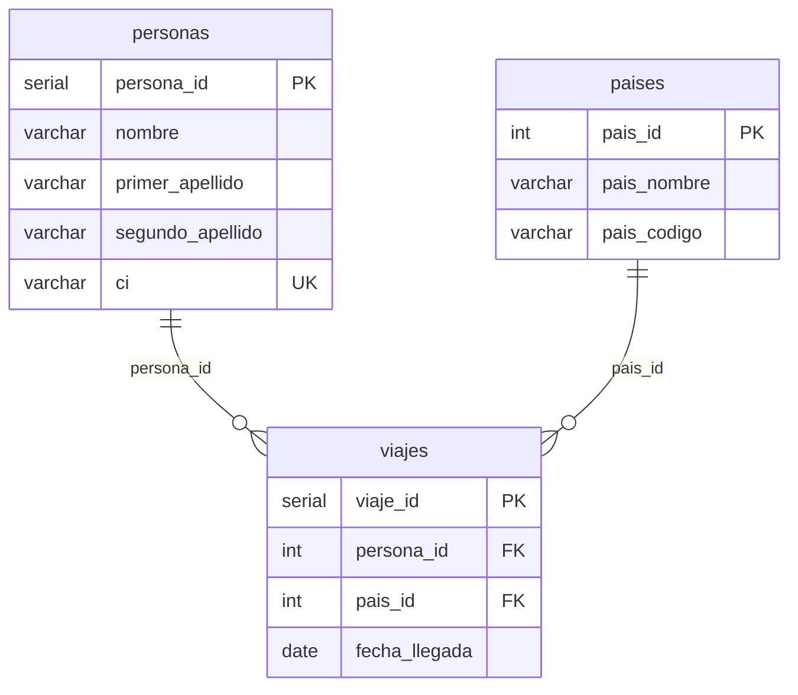

# Personas + PostgreSQL (FastAPI)

Monolito educativo: API REST en Python que se conecta a **PostgreSQL ya existente** (contenedor `my-database` de otro `docker-compose`). CRUD de personas y viajes, SQL directo con `psycopg2`.

## Requisitos

- Docker
- Stack PostgreSQL en marcha (`my-database`, puerto 5432 en el host)
- Red Docker compartida (p. ej. `bd-postgresql-docker_default`)

## Configuración

```bash
cp .env.example .env
# Ajusta credenciales y DOCKER_POSTGRES_NETWORK si tu red tiene otro nombre
```

Toda la conexión va en **`.env`** (`DB_HOST`, `DB_USER`, `DB_PASSWORD`, `DB_NAME`, etc.). No hay credenciales en el código.

| Variable | Uso |
|----------|-----|
| `API_HOST_PORT` | Puerto de la API en el host (default `8075`) |
| `DOCKER_POSTGRES_NETWORK` | Red donde está `my-database` |
| `DB_HOST` | `my-database` dentro de Docker; `localhost` si corres la app fuera de Docker |
| `DB_PORT` | `5432` hacia el contenedor PostgreSQL |

## Arranque

```bash
docker compose up --build
```

Un solo servicio **`api`**, igual que el ejemplo MySQL: se une a la red de `my-database` y lee `.env`.

- API: http://localhost:8075  
- Docs: http://localhost:8075/docs  

Al **arrancar la app**, se conecta a PostgreSQL, crea `DB_NAME` si no existe (con permiso `CREATEDB`), aplica `CREATE TABLE IF NOT EXISTS` y carga países si `paises` está vacía.

## Modelo ER (BD personas)

Base lógica en PostgreSQL (`DB_NAME` en `.env`). Tres tablas: catálogo de países, personas y viajes (N:M resuelto con tabla intermedia `viajes`).



- **personas → viajes**: `ON DELETE CASCADE` (borrar persona elimina sus viajes).
- **paises → viajes**: `ON DELETE CASCADE`.
- Índices: `idx_viajes_persona`, `idx_viajes_pais`.

## Endpoints

| Método | Ruta | Descripción |
|--------|------|-------------|
| GET | `/` | Resumen y ayuda Excel |
| POST | `/by-paul/personas` | Crear persona |
| POST | `/by-paul/personas_ps` | Crear persona (variante tutorial) |
| POST | `/by-paul/personas/import-excel` | Importar `.xlsx` |
| GET | `/by-paul/personas` | Listar personas |
| DELETE | `/by-paul/personas/{id}` | Eliminar persona (CASCADE en viajes) |
| POST | `/by-paul/viajes` | Crear viaje |
| GET | `/by-paul/viajes` | Listar viajes (JOIN) |

### Import Excel

Primera fila: `nombre`, `primer_apellido`, `segundo_apellido` (opcional), `ci`.  
CI duplicados se omiten; filas inválidas se reportan en la respuesta.

## Estructura

```
app/main.py               # API monolítica (endpoints)
app/database_bootstrap.py # BD + tablas + semilla (startup)
docker-compose.yml        # Solo api + red externa
.env.example              # Plantilla de variables
```

## Stack

Python 3.12 · FastAPI · Uvicorn · psycopg2 · openpyxl
